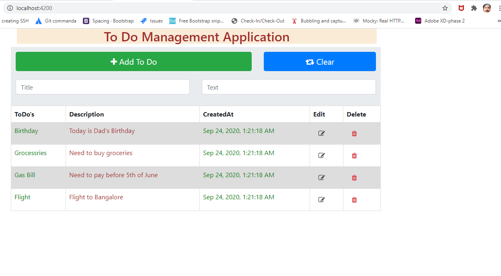

To Do Management Application
----------------------------
Name - Ashvani Sagun  (UI Developer)
----------------------------------
Technology Stack Used : Angular , HTML, CSS ,TypeScript and Bootstrap.
------------------------------------------------------------------
This application is made using Simple CRUD operations having 2 Modues. 
For Service Part I have used Json Server for which I have created a db.json file under assets.
==============================================================================================
//Steps to run To Do Management Application.
1. npm install and then npm start.
2. Go to Assets folder and run "json-server db.json" command to run the json server which will give a rest API kind of feature to handle all CRUD application for the to Do App.

**Screenshot**

